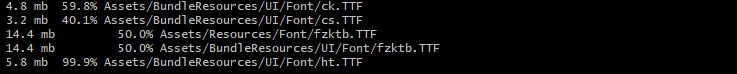

> 2020年1月13日笔记
> <!--more-->

包名:

tgac.0.0.1.10099.branches_dev_devops_2019-12-31.preview.2020.01.13.apk

构建Index:

第103次构建

初步分析:

```shell
                         1008591235 Byte    876193231 Byte  4144 files, 0 folders
```

压缩后的文件分布TOP40排名:


文件大头初步分析:

1. 绝大多数为bundle文件

   | 路径                                                         | 百分比      | 对应大小(MB) |
   | ------------------------------------------------------------ | ----------- | ------------ |
   | assets\Bundles\Android\ui\font\base_font_2.xj                | 2.196872968 | 18.54174328  |
   | assets\Res\pack0.dat                                         | 2.142172236 | 18.08006573  |
   | lib\x86\libunity.so                                          | 1.751641388 | 14.7839613   |
   | lib\armeabi-v7a\libunity.so                                  | 1.750701506 | 14.77602863  |
   | assets\Bundles\Android\autochess\map\base_prefab_1.xj        | 1.427451664 | 12.04778004  |
   | assets\Bundles\Android\lowtextures\base_1.xj                 | 1.31043442  | 11.06014729  |
   | assets\Bundles\Android\autochess\map\base_prefab_2.xj        | 1.185790775 | 10.00814724  |
   | assets\Bundles\Android\textures\base_14.xj                   | 1.183404686 | 9.988008499  |
   | assets\Bundles\Android\lowtextures\base_4.xj                 | 1.026912167 | 8.667201996  |
   | assets\bin\Data\a85f8be203a478a45a0685302a81c4b9             | 0.99527414  | 8.400175095  |
   | assets\bin\Data\7c4454b9f97bdc148b0bdf71e1075339             | 0.99527414  | 8.400175095  |
   | assets\Bundles\Android\lowtextures\base_3.xj                 | 0.984019509 | 8.305185318  |
   | assets\Bundles\Android\lowtextures\base_2.xj                 | 0.904153597 | 7.631112099  |
   | assets\Bundles\Android\textures\base_4.xj                    | 0.893044616 | 7.537351608  |
   | assets\Bundles\Android\textures\base_6.xj                    | 0.888821926 | 7.501711845  |
   | assets\Bundles\Android\jx3shaders\base_shader_1.xj           | 0.8588118   | 7.24842453   |
   | assets\Bundles\Android\textures\base_5.xj                    | 0.83541791  | 7.050978661  |
   | assets\Bundles\Android\autochess\map\base_prefab_3.xj        | 0.704892036 | 5.949332237  |
   | assets\Bundles\Android\autochess\effect\effecttexture\base_8.xj | 0.616880065 | 5.206505775  |
   | assets\Bundles\Android\uiatlaslevel\rgba32\base_uiatlas_3.xj | 0.608212765 | 5.133353233  |
   | assets\Bundles\Android\uiatlaslevel\rgba32\base_uiatlas_6.xj | 0.604490412 | 5.10193634   |
   | assets\Bundles\Android\textures\base_7.xj                    | 0.590182577 | 4.98117733   |
   | assets\Bundles\Android\textures\base_13.xj                   | 0.582549622 | 4.916754723  |
   | assets\Bundles\Android\ui\font\base_font_1.xj                | 0.57993393  | 4.894678116  |
   | assets\Bundles\Android\lowtextures\base_20.xj                | 0.579023426 | 4.886993408  |
   | assets\Bundles\Android\lowtextures\base_21.xj                | 0.563662037 | 4.757342339  |
   | assets\Bundles\Android\uiatlaslevel\rgba32\base_uiatlas_14.xj | 0.550548998 | 4.64666748   |
   | assets\Bundles\Android\uiatlaslevel\rgba32\base_uiatlas_20.xj | 0.515921382 | 4.354408264  |
   | assets\Bundles\Android\uiatlaslevel\rgba32\base_uiatlas_12.xj | 0.479133889 | 4.043919563  |
   | assets\Bundles\Android\ui\font\base_font_3.xj                | 0.477731976 | 4.032087326  |
   | assets\bin\Data\19808942475beeb4d9db2522d472b4e5             | 0.467694627 | 3.947371483  |
   | assets\Bundles\Android\uiatlaslevel\rgba32\base_uiatlas_2.xj | 0.466285934 | 3.935482025  |
   | assets\Bundles\Android\lowtextures\base_7.xj                 | 0.458556482 | 3.87024498   |
   | assets\Bundles\Android\uiatlaslevel\rgba32\base_uiatlas_7.xj | 0.448605574 | 3.786258698  |
   | assets\Bundles\Android\lowtextures\base_19.xj                | 0.425413378 | 3.590515137  |
   | assets\Bundles\Android\uiatlaslevel\rgba32\base_uiatlas_15.xj | 0.423616438 | 3.575348854  |
   | assets\Bundles\Android\uiatlaslevel\rgba32\base_uiatlas_5.xj | 0.412255933 | 3.479465485  |
   | assets\Bundles\Android\uiatlaslevel\rgba32\base_uiatlas_19.xj | 0.407138445 | 3.436273575  |
   | assets\Bundles\Android\autochess\effect\effecttexture\base_11.xj | 0.404697554 | 3.415672302  |

初步分析:

1. 50.3 kb	 15.9% Resources/unity_builtin_extra  有重复打包现象,会出现冗余

   

2. 字体文件占了大头,且有冗余

   

3. base_prefab_1.xj 有较多贴图文件,可尝试优化.

   

4. assets\Bundles\Android\lowtextures\base_1.xj 有比较大的贴图文件

   

   